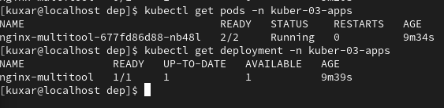
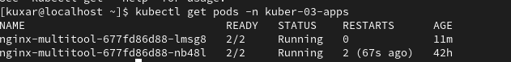
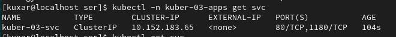
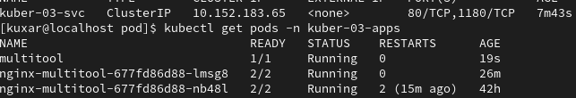
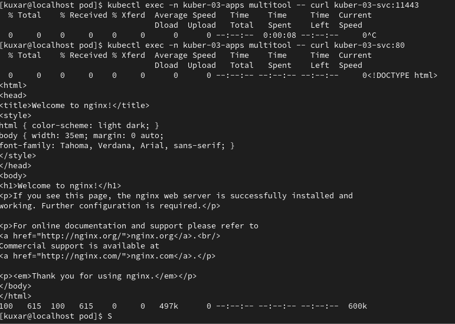
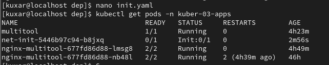
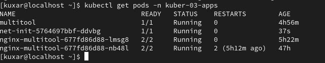

# kuber-03-apps
------
### Задание 1.

------

Создал для данного задания новый namespace "kuber-03-apps"

Написал Deployment

[net.yaml](yaml/net.yaml)

Успешно создал поды и произвел проверку

kubectl apply -n kuber-03-apps -f net.yaml 

Дорисовал двойку в деплоименте и принял изменения.

Создал сервис 

[ser-03.yaml](yaml/ser-03.yaml)

Создал под мультитула

[multi.yaml](yaml/multi.yaml)

Проверил работоспособность

kubectl exec -n kuber-03-apps multitool -- curl kuber-03-svc:11443

kubectl exec -n kuber-03-apps multitool -- curl kuber-03-svc:80

### Задание 2.

Создал новый деплой и запустил его

[init.yaml](yaml/init.yaml)

Создал сервис и запустил его

[init-svc.yaml](yaml/init-svc.yaml)

############################################################################################

# Домашнее задание к занятию «Запуск приложений в K8S»

### Цель задания

В тестовой среде для работы с Kubernetes, установленной в предыдущем ДЗ, необходимо развернуть Deployment с приложением, состоящим из нескольких контейнеров, и масштабировать его.

------

### Инструменты и дополнительные материалы, которые пригодятся для выполнения задания

1. [Описание](https://kubernetes.io/docs/concepts/workloads/controllers/deployment/) Deployment и примеры манифестов.
2. [Описание](https://kubernetes.io/docs/concepts/workloads/pods/init-containers/) Init-контейнеров.
3. [Описание](https://github.com/wbitt/Network-MultiTool) Multitool.

------

### Задание 1. Создать Deployment и обеспечить доступ к репликам приложения из другого Pod

1. Создать Deployment приложения, состоящего из двух контейнеров — nginx и multitool. Решить возникшую ошибку.
2. После запуска увеличить количество реплик работающего приложения до 2.
3. Продемонстрировать количество подов до и после масштабирования.
4. Создать Service, который обеспечит доступ до реплик приложений из п.1.
5. Создать отдельный Pod с приложением multitool и убедиться с помощью `curl`, что из пода есть доступ до приложений из п.1.

------

### Задание 2. Создать Deployment и обеспечить старт основного контейнера при выполнении условий

1. Создать Deployment приложения nginx и обеспечить старт контейнера только после того, как будет запущен сервис этого приложения.
2. Убедиться, что nginx не стартует. В качестве Init-контейнера взять busybox.
3. Создать и запустить Service. Убедиться, что Init запустился.
4. Продемонстрировать состояние пода до и после запуска сервиса.

------

### Правила приема работы

1. Домашняя работа оформляется в своем Git-репозитории в файле README.md. Выполненное домашнее задание пришлите ссылкой на .md-файл в вашем репозитории.
2. Файл README.md должен содержать скриншоты вывода необходимых команд `kubectl` и скриншоты результатов.
3. Репозиторий должен содержать файлы манифестов и ссылки на них в файле README.md.

------